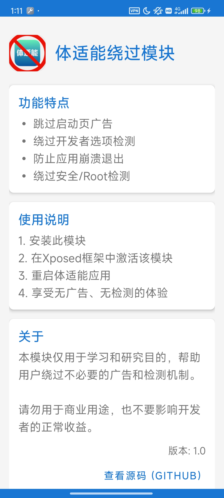

# 体适能绕过模块 (FuckTSN)


一个用于绕过体适能应用（com.bxkj.student）的Xposed模块，移除广告并绕过各种安全检测。

## 功能特点

- ✅ 跳过启动页广告
- ✅ 绕过开发者选项检测
- ✅ 防止应用崩溃退出
- ✅ 绕过安全/Root检测
- ✅ 自动同意隐私协议
- ✅ 拦截版本更新提示

## 截图



## 安装要求

- Android 8.0+ 设备
- 已安装的Xposed框架（LSPosed、EdXposed、原版Xposed）
- 体适能应用（com.bxkj.student）

## 使用方法

1. 下载并安装本模块
2. 在Xposed框架中激活模块（作用域仅选择"体适能"应用）
3. 重启设备或"体适能"应用
4. 打开"体适能"应用，享受无广告、无检测的体验

## 下载链接

[点击这里下载最新版本](https://github.com/pansoul1/Fuck-TSN/releases/tag/1.0)

## 实现原理

本模块通过以下方式绕过体适能应用的限制：

1. 通过Hook `SplashActivity` 类的 `U()` 方法跳过启动页广告
2. 通过Hook `android.provider.Settings.Secure.getInt` 方法绕过开发者选项检测
3. 通过延迟Hook `i0.b` 等安全检测类绕过应用加固的安全检测
4. 拦截 `System.exit()` 调用，防止应用崩溃退出
5. 拦截 `com.bxkj.student.common.versionupdate.a` 类的 `d()` 方法阻止更新弹窗

### 技术细节

模块针对应用的加固特性采用了延迟Hook策略：
- 立即Hook系统关键类（如`Debug.isDebuggerConnected`）
- 延迟Hook加固部分（i0包下的类与版本更新相关类）
- 采用失败重试机制提高成功率

## 更新日志

### v2.0
- 新增: 拦截应用版本更新提示功能
- 优化: 改进延迟Hook机制，提高稳定性
- 修复: 修复部分设备上可能出现的兼容性问题

### v1.0
- 首次发布
- 跳过启动页广告
- 绕过开发者选项检测
- 防止应用崩溃退出
- 绕过安全/Root检测
- 自动同意隐私协议

## 开发

### 环境要求

- Android Studio Iguana 2023.2.1 或更高版本
- JDK 11+
- Gradle 8.0+

### 编译指南

1. 克隆本仓库：
   ```
   git clone https://github.com/pansoul/FuckTSN.git
   ```

2. 在Android Studio中打开项目

3. 同步Gradle项目

4. 构建APK：
   ```
   ./gradlew assembleDebug
   ```

### 项目结构

- `app/src/main/java/com/pansoul/fucktsn/hook/` - Hook相关代码
- `app/src/main/java/com/pansoul/fucktsn/MainActivity.kt` - 应用主界面
- `app/src/main/assets/xposed_init` - Xposed模块入口点配置

## 免责声明

本模块仅用于学习和研究目的，帮助用户绕过不必要的广告和检测机制。请勿用于商业用途，也不要影响开发者的正常收益。使用本模块所产生的任何后果由用户自行承担。

## 协议

本项目采用 [MIT 许可证](LICENSE)。

## 贡献

欢迎提交Pull Request或Issue来帮助改进这个项目。

## 联系方式

- GitHub：[pansoul](https://github.com/pansoul1)

## 致谢

- [Xposed框架](https://github.com/rovo89/Xposed)
- [LSPosed](https://github.com/LSPosed/LSPosed)